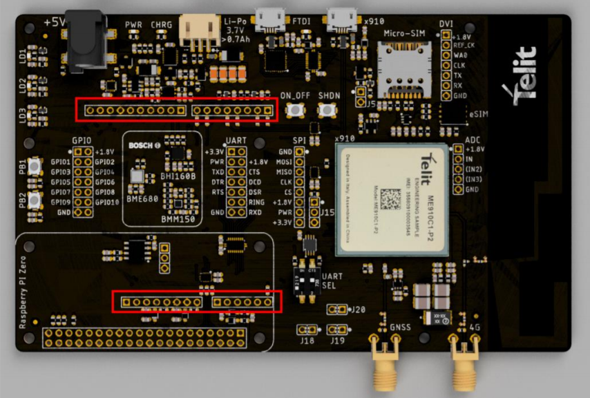
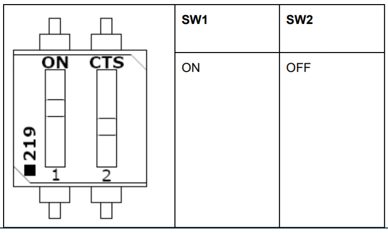

# Bravo Board Arduino Demonstrator

## Prerequisites

 - Please visit [Bravo Evaluation Kit page](https://www.telit.com/developer-zone/telit-bravo-evaluation-kit/) board and read *"Bravo Quick Start Guide"*. If you want to try the LwM2M demo or use Telit embedded connectivity SimWISE, please read also *"Bravo Getting Started OneEdge"*

## HW SETTINGS

 - Connect the Bravo board at the ArduinoZero board with the Berg connectors previously soldered (as reported in the Bravo Quick Start Guide)

 - External power is needed for both Arduino and Bravo board 

 - Bring a GPIO from 1.8V from the Bravo board and connect it to GPIO A3 of the Arduino (this GPIO is used to monitor the status of the modem (ON/OFF) from the Arduino)

 - Set UART SEL dip switches as shown below:

 - Insert a SIM card without PIN number inserted or use the SimWISE profile as explained in *"Bravo Getting Started OneEdge"*

 - Power on the modem with the power button on the Bravo Board (hold for 5 seconds approx)

## SW SETTINGS

- Download the necessary files on a Directory in the host PC (e.g. in the Desktop folder as "Desktop/Bravo_Project")

    - Bravo_arduino.ino

    - object_26251.xml

## Additional settings

In the `Bravo_arduino.ino` file there are few parameters to configure:

 - `APN = ""` set it based on your mobile operator APN (for SimWISE please use "NXT17.NET")

 - Enable/disable the example you want to run between **"echo_demo"** or **"lwm2m_demo"** inside the `main` function. For lwm2m_demo ensure you've read the *"Bravo Getting Started OneEdge"* thoroughly

 - In order to use the lwm2m_demo example, the file "object_25261.xml" must be loaded in the module previously manually with AT Command "AT#M2MWRITE=/XML/object_25261.xml,1971"

## Execution

To run the demo, execute the sketch `Bravo_arduino.ino` file uploading it on the Arduino board

